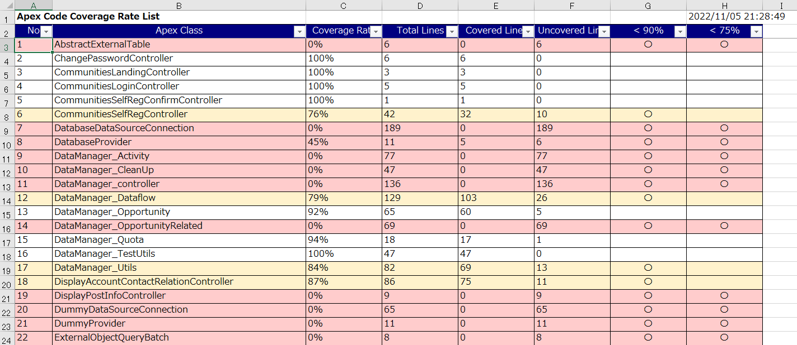
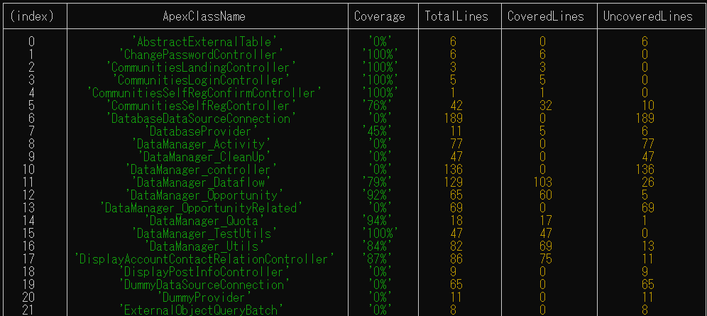

# get-coverages
<p align="center">
  
  
  
  
</p>

Output Salesforce Apex class coverage rates to Excel or console, and also execute Apex test classes from the CLI
## Output samples
Output to excel  
[](./images/sample.png)

Output to console  
[](./images/sample2.png)


## Installation
Install [Node.js](https://nodejs.org/) and place the following files in any directory.

* get-coverages.js
* user_config.yaml
* template.xlsx
* package.json
* package-lock.json

Install required libraries.
```
$ npm install
```

## Edit config file
Open user_config.yaml and edit login URL, user name, and password to match your environment.
```
# Salesforce connection information
loginUrl: "https://test.salesforce.com"
apiVersion : "56.0"
userName: "(LOGIN USER NAME)"
password: "(LOGIN PASSWORD)"
```
Change result excel file path as necessary.
```
# Result excel file path
resultFilePath: "result.xlsx"
```

Change warning rate or fatal rate as necessary.You can also change the excel output colors.
```
# Warning coverage rate and output color
warningPercent: 0.90
warningColor: "fff2cc"
# Fatal coverage rate and output color
fatalPercent: 0.75
fatalColor: "ffcccc"
```
TargetApexClass is commented out by default. If you want to narrow the Apex classes to output, specifies the apex classes.
```
# Specifies apex classes to output coverage rate(If empty, all apex classes are targeted)
#targetApexClass: [
#  ChangePasswordController, 
#  CommunitiesLoginController, 
#]
```
TargetApexTestClass is commented out by default. If you want to narrow the Apex test classes to execute test, specifies the apex classes.
```
# Specifies apex test classes to execute test(If empty, all apex test classes are targeted)
#targetApexTestClass: [
#  ChangePasswordControllerTest, 
#  CommunitiesLoginControllerTest,
#]
```

## Usage
Execute a get-coverage.js with Node.js in a terminal. If there is no option, It uses the default config file. (default is "./user_config.yaml")
```
$ node get-coverage.js
```
After execution, excel of the result is output.

If you want to output the results to the console, use the -d option.
```
$ node get-coverage.js -d
```

If you want to execute apex tests, use the -t option.
```
$ node get-coverage.js -t
```
After execution, the following log is output to confirm the test execution status.
```
[2022/11/05 22:36:33] ApexTestResult:
[2022/11/05 22:36:37]   [4%]ChangePasswordControllerTest:OK(1/1)
[2022/11/05 22:36:37]   [8%]SiteLoginControllerTest:OK(1/1)
[2022/11/05 22:36:37]   [12%]DataManager_QuotaTest:NG(0/1)
[2022/11/05 22:36:37]   [16%]DisplayAccountContactRelationControllerT:OK(2/2)
[2022/11/05 22:36:37]   [20%]DataManager_UtilsTest:OK(5/5)
[2022/11/05 22:36:37]   [24%]LightningSelfRegisterControllerTest:OK(9/9)
[2022/11/05 22:36:37]   [28%]DataManager_DataflowTest:OK(1/1)
[2022/11/05 22:36:37]   [32%]LightningForgotPasswordControllerTest:OK(3/3)
[2022/11/05 22:36:37]   [36%]LightningLoginFormControllerTest:NG(5/6)
[2022/11/05 22:36:37]   [40%]MyProfilePageControllerTest:OK(1/1)
[2022/11/05 22:36:37]   [44%]MicrobatchSelfRegControllerTest:OK(1/1)
[2022/11/05 22:36:37]   [48%]Upload_ProcessTest_EM:OK(1/1)
[2022/11/05 22:36:37]   [52%]Upload_controller_EMTest:NG(1/3)
[2022/11/05 22:36:37]   [56%]Upload_Init_EMTest:NG(0/2)
[2022/11/05 22:36:37]   [60%]CommunitiesSelfRegConfirmControllerTest:OK(1/1)
[2022/11/05 22:36:37]   [64%]CommunitiesSelfRegControllerTest:OK(1/1)
[2022/11/05 22:36:37]   [68%]CommunitiesLandingControllerTest:OK(1/1)
[2022/11/05 22:36:37]   [72%]CommunitiesLoginControllerTest:OK(1/1)
[2022/11/05 22:36:37]   [76%]ForgotPasswordControllerTest:OK(1/1)
[2022/11/05 22:36:40]   [80%]SiteRegisterControllerTest:OK(1/1)
[2022/11/05 22:36:40]   [84%]DataManager_ActivityTest:NG(0/1)
[2022/11/05 22:36:40]   [88%]DataManager_OpportunityRelatedTest:NG(0/1)
[2022/11/05 22:36:40]   [92%]DataManager_OpportunityTest:NG(0/1)
[2022/11/05 22:36:40]   [96%]DataManager_CleanUpTest:NG(0/1)
[2022/11/05 22:36:51]   [100%]DataManager_controllerTest:NG(0/1)
[2022/11/05 22:36:51]   *** ApexTestClassCount:25 OK:16 NG:9 ***
```

If you want to use a non-default configuration file, specify the file with the -c option.
```
$ node get-coverages.js -c YourConfigFile.yaml
```

The following are the available options of entire.
```
usage: get-coverages.js [-options]
    -c <pathname> specifies a config file path (default is ./user_config.yaml)
    -s            silent mode
    -i            include invalid coverage
    -d            display test coverage to console
    -t            execute apex test
    -h            display this help
````

## License
get-coverages is licensed under the MIT license.

